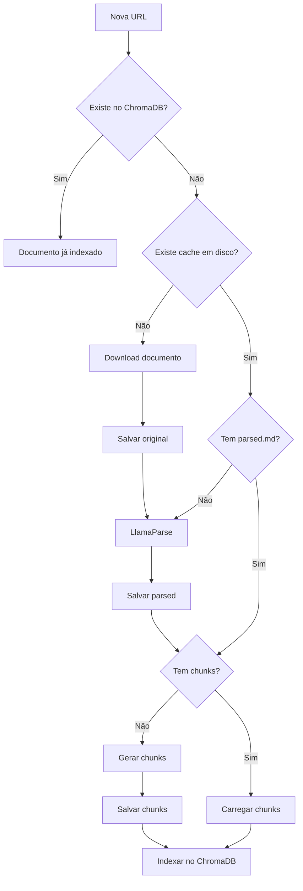

# Plano de Melhoria do Processo de Ingestão de Documentos

## Objetivo
Melhorar o processo de ingestão de arquivos adicionando cache em disco e sistema de chunking, mantendo rastreabilidade dos artefatos gerados durante o processamento.

## Requisitos
1. Continuar usando LlamaParse para processamento
2. Armazenar em disco: documento original, documento processado, chunks
3. Verificar se documento já está indexado antes de processar
4. Reutilizar artefatos existentes quando possível
5. Implementar sistema de chunking para melhor retrieval

## Estrutura de Armazenamento
```
.cache/
├── documents/
│   ├── {url_hash}/
│   │   ├── metadata.json    # URL original, timestamps, status
│   │   ├── original.bin     # Documento original baixado
│   │   ├── parsed.md        # Resultado do LlamaParse
│   │   └── chunks.json      # Chunks gerados
```

## Fluxo de Processamento


## Fases de Implementação

### Fase 1: Infraestrutura de Cache (✅ Entregável: Sistema básico de cache) ✅ CONCLUÍDA
- [x] Criar classe `DocumentCache` em `src/repositories/document_cache.py`
- [x] Implementar métodos básicos: `exists()`, `save_original()`, `load_original()`
- [x] Adicionar hash de URL para identificação única
- [x] Criar estrutura de diretórios automaticamente
- [x] Adicionar testes unitários

**Valor**: Permite salvar e recuperar documentos originais do disco

### Fase 2: Integração com Settings (✅ Entregável: Download com cache) ✅ CONCLUÍDA
- [x] Modificar `settings.py` para usar `DocumentCache`
- [x] Salvar documento original após download
- [x] Verificar cache antes de fazer novo download
- [x] Adicionar indicador visual de status (cached/new)

**Valor**: Evita re-download de documentos já baixados

### Fase 3: Cache de Documentos Processados (✅ Entregável: Cache completo)
- [ ] Estender `DocumentCache` com `save_parsed()`, `load_parsed()`
- [ ] Modificar `Document` class para usar cache
- [ ] Salvar resultado do LlamaParse
- [ ] Implementar metadata.json com timestamps

**Valor**: Evita reprocessamento pelo LlamaParse (economia de API calls)

### Fase 4: Sistema de Chunking (✅ Entregável: Documentos divididos)
- [ ] Criar `DocumentChunker` em `src/services/document_chunker.py`
- [ ] Implementar algoritmo de chunking com overlap
- [ ] Definir estrutura de dados para chunks
- [ ] Adicionar configurações (chunk_size, overlap)
- [ ] Criar testes com diferentes tipos de texto

**Valor**: Melhora a precisão do retrieval com chunks menores

### Fase 5: Integração do Chunking com Cache (✅ Entregável: Pipeline completo)
- [ ] Estender `DocumentCache` com `save_chunks()`, `load_chunks()`
- [ ] Modificar fluxo para gerar/carregar chunks
- [ ] Atualizar indexação no ChromaDB para usar chunks
- [ ] Manter referência ao documento original em cada chunk

**Valor**: Cache completo de todo o pipeline de processamento

### Fase 6: Verificação de Documentos Indexados (✅ Entregável: Otimização)
- [ ] Implementar verificação no ChromaDB antes de processar
- [ ] Criar método para sincronizar cache com ChromaDB
- [ ] Adicionar comando para re-indexar do cache
- [ ] Implementar limpeza de cache órfão

**Valor**: Evita processamento desnecessário de documentos já indexados

### Fase 7: Melhorias na UI e Observabilidade (✅ Entregável: UX melhorada)
- [ ] Adicionar progress bar durante processamento
- [ ] Mostrar estatísticas do cache
- [ ] Adicionar botão para limpar cache
- [ ] Exibir origem dos dados (cache/novo)
- [ ] Log detalhado do processamento

**Valor**: Melhor experiência do usuário e debugging

## Estrutura de Classes Proposta

```python
# src/repositories/document_cache.py
class DocumentCache:
    def __init__(self, cache_dir: Path = Path(".cache/documents"))
    def get_document_hash(self, url: str) -> str
    def get_document_path(self, url: str) -> Path
    def exists(self, url: str) -> bool
    def save_original(self, url: str, content: bytes) -> None
    def save_parsed(self, url: str, markdown: str) -> None
    def save_chunks(self, url: str, chunks: List[Chunk]) -> None
    def save_metadata(self, url: str, metadata: dict) -> None
    def load_original(self, url: str) -> bytes
    def load_parsed(self, url: str) -> str
    def load_chunks(self, url: str) -> List[Chunk]
    def load_metadata(self, url: str) -> dict

# src/services/document_chunker.py
@dataclass
class Chunk:
    content: str
    index: int
    start_char: int
    end_char: int
    metadata: dict

class DocumentChunker:
    def __init__(self, chunk_size: int = 1000, overlap: int = 200)
    def chunk_document(self, text: str, metadata: dict = None) -> List[Chunk]

# src/services/document_processor.py
class DocumentProcessor:
    def __init__(self, cache: DocumentCache, chunker: DocumentChunker, 
                 llama_parse: LlamaParse, collection: ChromaCollection)
    def process_url(self, url: str) -> ProcessingResult
    def is_indexed(self, url: str) -> bool
    def reindex_from_cache(self, url: str) -> bool
```

## Métricas de Sucesso
- Redução no tempo de re-indexação: >80%
- Redução no uso de API calls do LlamaParse: 100% para documentos em cache
- Melhoria na precisão do retrieval com chunking
- Zero perda de dados durante o processamento

## Próximos Passos
1. Revisar e aprovar o plano
2. Começar implementação pela Fase 1
3. Validar cada fase antes de prosseguir para a próxima